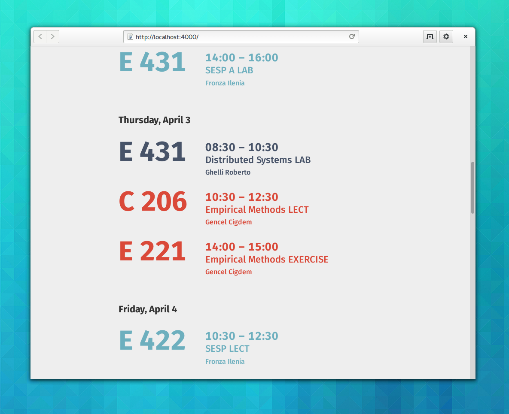

unibz-timetable
===============

A simple timetable based on the unibz timetable RSS feed.

It's a fully client-side web app using the Google Feeds API to get the data from the RSS feed and Ember.js to dynamically render the results.

Check it out [here](http://tobiasbernard.com/unibz-timetable).

#####Note:
***This site is still in development and not very well tested, so if you encounter any problems specific to your device/browser, please report them.***

***Currently, there are some weird problems specific to Webkit (e.g. Chrome and Safari), so for now just use Firefox if you want everything to work.***

##FAQ

###How can I use this with my personal timetable?

####1. Set up the timetable
Go to your student portal page and set up a personalized timetable by adding your courses to it.

*If you already have a personalized time table you can skip this step.*

####2. Copy the RSS Feed URL
Open your personal timetable inside the student portal. On the top right, next to the timespan selector, there is a link with the caption **"RSS"**. Right click on this link and select **"Copy link location"**.

The URL should look similar to this:
```
http://aws.unibz.it/risweb/timetable.aspx?showtype=0&acy=7&dep=4182&spoid=17529&format=rss
```

####3. Paste the URL in the input on the page
Now [open the application](tobiasbernard.com/unibz-timetable) and paste the URL you copied before into the input field on top of the page.
The page will now reload and display the data from your RSS feed. Since the URL is saved in your Browser's localStorage, it persists across page reloads.

***Note:***
*If you change your feed in the student portal it might take a while (around 30min or so) for the data in the app to update, because the Google API used to access it caches the feed contents.*

####4. Profit
Now you can enjoy your cool new timetable :D

####Alternative: Create a custom URL (e.g. for sharing it with other people)
Simply add the URL you copied in step 2 to this base URL: 
```
tobiasbernard.com/unibz-timetable/?=
```
The result should look similar to this:
```
tobiasbernard.com/unibz-timetable/?=http://aws.unibz.it/risweb/timetable.aspx?showtype=0&acy=7&dep=4182&spoid=17529&format=rss
```
This URL will work (show the same data) on any computer, because the link to the RSS feed is included in it.

###How can I use this with a public timetable (e.g. faculty timetables)?
The technique explained above works for all timetable RSS feeds, not just the ones for personal timetables.
For example, you want your course's official timetable, you can just go to the timetable website and copy the RSS link from there, just as you would for a personal time table.

###I don't understand the explanation above
If you have any problems setting up your timetable, just [shoot me an email](hi@tobiasbernard.com).

###Where are the screenshots?
Right here:


###Why are the room names so big?
Because for how I use it, that's by far the most important information on the timetable. Also, it looks cool.

###I found a bug/would like to suggest a feature!
Great, thanks.
You can either [file an issue](https://github.com/bertob/unibz-timetable/issues) on Github or [email me](hi@tobiasbernard.com).
